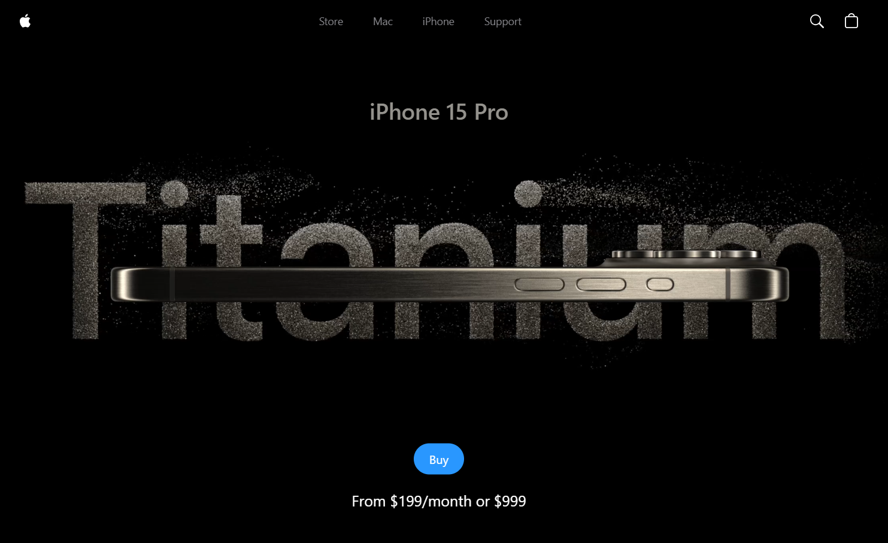

# 🍎 Apple UI/UX Clone

Welcome to the Apple UI/UX Clone project! This project is a modern, responsive web application that mimics the sleek and intuitive design of Apple's user interfaces. Built with React and Vite, it showcases a stylish and interactive Apple-inspired UI featuring a video carousel, a hero section, and a sleek navigation bar.



## 📖 Description

This project replicates the elegant and minimalistic design of Apple’s website using React and Vite. The application includes:

- **Hero Section**: A captivating introduction with a full-screen video background and a call-to-action button.
- **Video Carousel**: A dynamic video carousel with smooth transitions and interactive controls.
- **Navbar**: A responsive navigation bar with links and icons, inspired by Apple's design language.

## ⚙️ Technologies Used

- **React**: A JavaScript library for building user interfaces.
- **Vite**: A fast build tool that provides a modern development experience and optimized production builds.
- **GSAP**: The GreenSock Animation Platform for high-performance animations.
- **Sentry**: For performance monitoring and error tracking.
- **TailwindCSS**: A utility-first CSS framework for rapid UI development.

## 🚀 Getting Started

To get started with the project, follow these steps:

### Installing and Running Project

Clone Project and cd into project
```
git clone https://github.com/ApeSkillx/iphone15.git && cd iphone15
```
Install Dependencies
```
npm install
```
Run the Development Server
```
npm run dev
```
Open your browser and navigate to http://localhost:3000 to view the app.

## 🌟 Features

**Responsive Design:** Adapts seamlessly to various screen sizes and devices.
**Interactive Video Carousel:** Features smooth transitions and interactive controls for an engaging video experience.
**Elegant Animations:** Utilizes GSAP for high-performance and visually appealing animations.
**Sleek Navigation Bar:** A modern, responsive navbar with Apple-inspired design elements.
**Adaptive Hero Section:** Displays a full-screen video that adjusts based on screen size, with an eye-catching call-to-action.

## 🛠️ Development

Feel free to contribute to this project! Here’s how you can get involved:

**Report Bugs:** If you find any issues, please open an issue on GitHub.
**Suggest Features**: Have an idea for a new feature? Let us know!
**Contribute Code:** Fork the repository, make your changes, and submit a pull request.

For detailed contribution guidelines, please refer to the CONTRIBUTING.md file.

## 📜 License
This project is licensed under the MIT License - see the LICENSE file for details.

## More
More UI / UX design upgrades will be added like more GSAP animations and 3D animated model of iphone more of by using  React Three Fiber which is a React renderer for Three.js. and Three.js a JavaScript library used for creating and displaying 3D graphics. (Assets are already uploaded).